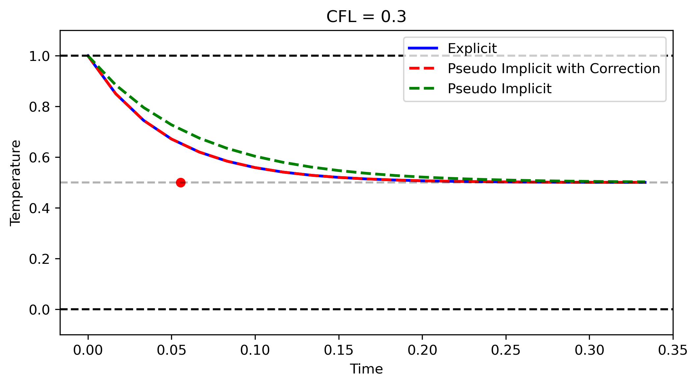
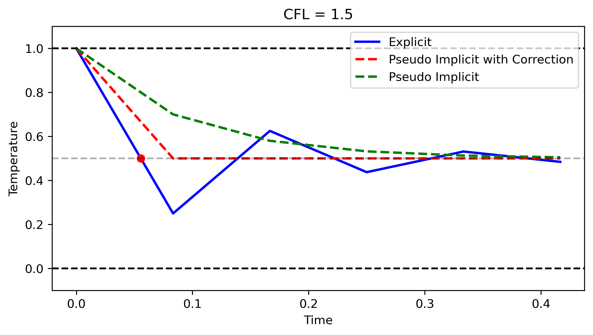

# Implicit viscosity

## Problem description

In simulations with strong radial gradients in density, e.g. at the gap edge
carved by a massive planet or at the disk truncation radius caused by a
companion, the velocity updates by the viscous terms can become unstable and
cause a crash. This is caused by a too large timestep overshooting the viscous
velocity updates and spiraling out of control.

From our simulations on cataclysmic variables we found the cause of the crash to
be the azimuthal velocity update from the viscous stress tensor that reads:

$\Delta v_\varphi = \frac{dt}{R_b^i} \frac{1}{0.5 \cdot (\Sigma^{i,j} + \Sigma^{i,j-1})} \left[\frac{2}{(R_a^{i+1})^2 - (R_a^i)^2} \cdot ((R_a^{i+1})^2 \tau_{r \varphi}^{i+1} - (R_a^i)^2 \tau_{r \varphi}^i) + (\tau_{\varphi \varphi}^{i,j} - \tau_{\varphi \varphi}^{i,j-1}) \cdot \frac{1}{\Delta \varphi}\right]$

where i is the radial index and j the azimuthal index, $R_b$ is the radius of
the cell center, $R_a$ is the radius of the cell interface, $\Sigma$ is the
surface density, $\tau_{r\varphi}$ and $\tau_{\varphi \varphi}$ are components
of the viscous stress tensor. The indices i,j are omitted if the are the same
among the cells. Strong radial gradients in density and temperature cause
strong radial gradients in $\tau_{r \varphi}$ where the value for neighboring
cells can reach differences above a factor of 100, causing numerical instability.

## Proposed Solution

The viscous interactions between the cells are a diffusion process. Therefore
the velocity should never become faster/slower than the fastest/slowest cell
it is in contact with. During the timestep, we consider all properties but the
azimuthal velocity of the cell we want to update as fixed (similar as for an
Euler step). Then the velocity update caused by the viscous stress tensor can
be written in the form:

$\dot{v}_\varphi = c_1 \cdot v_\varphi + c_2$

This function is easily solvable and the azimuthal velocity should
exponentially converge towards a equilibrium velocity of $v_{eq} =
-\frac{c_2}{c_1}$. We can now argue, that the explicit velocity update step
should not overshoot over $v_{eq}$.

## Stabilizing Scheme

The explicit form of the update is:
${v}_\varphi^\mathrm{new} = v_\varphi + dt (c_1 \cdot v_\varphi + c_2)$

The implicit form of the update is:
${v}_\varphi^\mathrm{new} = v_\varphi + dt (c_1 \cdot v_\varphi^\mathrm{new} + c_2)$

${v}_\varphi^\mathrm{new} = \frac{v_\varphi + dt c_2}{1 - dt \cdot c_1}$

${v}_\varphi^\mathrm{new} = v_\varphi + dt \frac{c_1 \cdot v_\varphi + c_2}{1 - dt \cdot c_1}$

We recognize that the implicit update step is the explicit one damped by a
factor of $\frac{1}{1-dt\cdot c_1}$ ($c_1 <= 0$).

We can now demand that the implicit step is the same as the explicit step. If
we do this, we find that we need to correct the constants used in the implicit
step by a factor of $c_1^\mathrm{implicit} = \frac{c_1^\mathrm{explicit}}{1+
dt\cdot c_1^\mathrm{explicit}$. If the term $1 + dt\cdot c_1$ becomes zero or
negative, the explicit update overshoots over the equilibrium velocity of the
current system, causing instability. If we define $c_1^\mathrm{implicit} =
\frac{c_1^\mathrm{explicit}}{\mathrm{max}(0,\,\, 1+ dt\cdot
c_1^\mathrm{explicit})}$ then the implicit scheme will reproduce the explicit
scheme while it is stable ($1 + dt \cdot c_1 > 0$) and damp the velocity
update step when $(1 + dt \cdot c_1 < 0)$ to guarantee stability, though this
will not conserve angular momentum anymore.

We can simplify the update to

${v}_\varphi^\mathrm{new} = v_\varphi + dt \frac{c_1 \cdot v_\varphi + c_2}{\mathrm{max}(0,\,\,1 + dt\cdot c_1) - dt \cdot c_1}$

where the numerator is the explicit update as it was used before.

${v}_\varphi^\mathrm{new} = v_\varphi + \frac{\Delta v_\varphi^{\mathrm{expl}}}{\mathrm{max}(0,\,\,1 + dt\cdot c_1) - dt \cdot c_1}$

thus we only need to compute $c_1$, aka all terms that contain $v_\varphi$.
This update will always be stable.

$\frac{d v}{dt} = \frac{1}{R_b^i} \frac{1}{0.5 \cdot (\Sigma^{i,j} + \Sigma^{i,j-1})}[\frac{2}{(R_a^{i+1})^2 - (R_a^i)^2}\cdot ((R_a^{i+1})^2 \tau_{r\varphi}^{i+1} - (R_a^i)^2 \tau_{r\varphi}^i) + (\tau_{\varphi\varphi}^{i,j} - \tau_{\varphi\varphi}^{i,j-1}) \cdot \frac{1}{\Delta\varphi}]$

$\frac{d v}{dt} \cdot (R_b^i \cdot \frac{1}{2} (\Sigma^{i,j} + \Sigma^{i,j-1})) = \frac{2}{(R_a^{i+1})^2 - (R_a^i)^2}\cdot ((R_a^{i+1})^2 \tau_{r\varphi}^{i+1} - (R_a^i)^2 \tau_{r\varphi}^i) + (\tau_{\varphi\varphi}^{i,j} - \tau_{\varphi\varphi}^{i,j-1}) \cdot \frac{1}{\Delta\varphi}$

For simplicity, we compute the two terms separately and combine them again later:

## $\tau_{r\varphi}$

$\frac{2}{(R_a^{i+1})^2 - (R_a^i)^2}\cdot ((R_a^{i+1})^2 \tau_{r\varphi}^{i+1} - (R_a^i)^2 \tau_{r\varphi}^i)$

With

$\frac{2}{(R_a^{i+1})^2 - (R_a^i)^2} = \frac{2}{\Delta (R_a^2)^{i}$

$\tau_{r\varphi} = d_{rp} \bar{\nu} \bar{\Sigma}$

$d_{r \varphi} = R_a \frac{dv_\varphi/r}{dr} + \frac{1}{R_a} \frac{dv_r}{d\varphi}$

$(\frac{dv_\varphi/r}{dr})^i = \frac{v_\varphi^i / R_b^i - v_\varphi^{i-1} / R_b^{i-1}}{R_b^i - R_b^{i-1} }$

we can expand the term to

$\frac{2}{\Delta (R_a^2)^{i}}[(R_a^2 \bar{\nu} \bar{\Sigma})^{i+1} ( R_a^{i+1} \frac{v_\varphi^{i+1} / R_b^{i+1} - v_\varphi^{i} / R_b^{i}}{R_b^{i+1} - R_b^{i}} + \frac{1}{R_a^{i+1}} (\frac{dv_r}{d\varphi})^{i+1})$
$- (R_a^2 \bar{\nu} \bar{\Sigma})^{i} ( R_a^{i} \frac{v_\varphi^i / R_b^i - v_\varphi^{i-1} / R_b^{i-1}}{R_b^i - R_b^{i-1}} + \frac{1}{R_a^{i}} (\frac{dv_r}{d\varphi})^{i})]$

We are only interested in terms that contain $v_\varphi$:

$\frac{2}{\Delta (R_a^2)^{i}}[(R_a^2 \bar{\nu} \bar{\Sigma})^{i+1} ( R_a^{i+1} \frac{- v_\varphi^{i} / R_b^{i}}{R_b^{i+1} - R_b^{i}}) + (R_a^2 \bar{\nu} \bar{\Sigma})^{i} ( R_a^{i} \frac{-v_\varphi^i / R_b^i}{R_b^i - R_b^{i-1}})]$

$v_\varphi^i \cdot \frac{-2}{R_b^i \Delta (R_a^2)^{i}}[(R_a^3 \bar{\nu} \bar{\Sigma})^{i+1} (\frac{1}{R_b^{i+1} - R_b^{i}}) + (R_a^3 \bar{\nu} \bar{\Sigma})^{i} (\frac{1}{R_b^i - R_b^{i-1}})]$

We can now define the constant

$c_{1,r\varphi} = -\frac{2}{\Delta (R_a^2)^{i}} \frac{1}{R_b^i}\left((\frac{R_a^3 \bar{\nu} \bar{\Sigma}}{\Delta R_b})^{i+1} + (\frac{R_a^3 \bar{\nu} \bar{\Sigma}}{\Delta R_b})^{i}\right)$

## $\tau_{\varphi\varphi}$

$(\tau_{\varphi\varphi}^{i,j} - \tau_{\varphi\varphi}^{i,j-1}) \cdot \frac{1}{\Delta\varphi}$

With
$\tau_{\varphi\varphi} = 2\nu\Sigma(d_{\varphi\varphi} - \frac{1}{3}\nabla v)$

$d_{\varphi\varphi} = \frac{v_\varphi^{j+1} - v_\varphi^j}{R_b^i \Delta \varphi} + \frac{1}{2}\frac{v_r^{i+1} + v_r^i}{R_b^i}$

$\nabla v = \frac{v_r^{i+1} R_a^{i+1} - v_r^i R_a^i}{(R_a^{i+1} - R_a^i) R_b^i} + \frac{v_\varphi^{j+1} - v_\varphi^j}{R_b^i \Delta \varphi}$

$\tau_{\varphi\varphi} = 2\nu\Sigma\left[\frac{2}{3}\frac{v_\varphi^{j+1} - v_\varphi^j}{R_b^i \Delta \varphi} + \frac{1}{2}\frac{v_r^{i+1} + v_r^i}{R_b^i} - \frac{1}{3}\frac{v_r^{i+1} R_a^{i+1} - v_r^i R_a^i}{(R_a^{i+1} - R_a^i) R_b^i}\right] + \nu_a (\frac{v_r^{i+1} R_a^{i+1} - v_r^i R_a^i}{(R_a^{i+1} - R_a^i) R_b^i} + \frac{v_\varphi^{j+1} - v_\varphi^j}{R_b^i \Delta \varphi})$

We can expand the term:
$\frac{(2\nu\Sigma)^j}{\Delta\varphi}\left[\frac{2}{3}\frac{v_\varphi^{j+1} - v_\varphi^j}{R_b^i \Delta \varphi} + \frac{1}{2}\frac{v_r^{i+1} + v_r^i}{R_b^i} - \frac{1}{3}\frac{v_r^{i+1} R_a^{i+1} - v_r^i R_a^i}{(R_a^{i+1} - R_a^i) R_b^i}\right] + \frac{\nu_a^j}{\Delta \varphi} (\frac{v_r^{i+1} R_a^{i+1} - v_r^i R_a^i}{(R_a^{i+1} - R_a^i) R_b^i} + \frac{v_\varphi^{j+1} - v_\varphi^j}{R_b^i \Delta \varphi})$
$-\frac{(2\nu\Sigma)^{j-1}}{\Delta\varphi}\left[\frac{2}{3}\frac{v_\varphi^{j} - v_\varphi^{j-1}}{R_b^i \Delta \varphi} + \frac{1}{2}\frac{v_r^{i+1,j-1} + v_r^{i,j-1}}{R_b^i} - \frac{1}{3}\frac{v_r^{i+1,j-1} R_a^{i+1} - v_r^{i,j-1} R_a^i}{(R_a^{i+1} - R_a^i) R_b^i}\right] - \frac{\nu_a^{j-1}}{\Delta \varphi} (\frac{v_r^{i+1,j-1} R_a^{i+1} - v_r^{i,j-1} R_a^i}{(R_a^{i+1} - R_a^i) R_b^i} + \frac{v_\varphi^{j} - v_\varphi^{j-1}}{R_b^i \Delta \varphi})$

We drop all terms that do not contain $v_\varphi$:
$\frac{(2\nu\Sigma)^j}{\Delta\varphi}\left[\frac{2}{3}\frac{- v_\varphi^j}{R_b^i \Delta \varphi}\right] + \frac{\nu_a^j}{\Delta \varphi} (- v_\varphi^j}{R_b^i \Delta \varphi})$
$-\frac{(2\nu\Sigma)^{j-1}}{\Delta\varphi}\left[\frac{2}{3}\frac{v_\varphi^{j}}{R_b^i \Delta \varphi} \right] - \frac{\nu_a^{j-1}}{\Delta \varphi} (\frac{v_\varphi^{j}}{R_b^i \Delta \varphi})$

$v_\varphi^j \frac{2}{3}\frac{-1}{R_b^i \Delta \varphi} [\frac{(2\nu\Sigma)^j}{\Delta\varphi} + \frac{(2\nu\Sigma)^{j-1}}{\Delta\varphi}]$
$- v_\varphi^j \frac{1}{R_b^i \Delta \varphi^2} (\nu_a^j + \nu_a^{j-1})$

We can now define the constants:

$c_{1,\varphi\varphi} = -\frac{2}{3}\frac{1}{R_b \Delta \varphi}\left[\frac{(2\nu\Sigma)^j}{\Delta\varphi} + \frac{(2\nu\Sigma)^{j-1}}{\Delta\varphi}\right] - \frac{1}{R_b^i \Delta \varphi^2} (\nu_a^j - \nu_a^{j-1})$

Using the constants above, we can finally define

$c_{1,\,v_\varphi} = \frac{1}{R_b^i} \frac{1}{0.5 \cdot (\Sigma^{i,j} + \Sigma^{i,j-1})}(c_{1,r\varphi} + c_{1,\varphi\varphi})$

## Vr case

$\frac{d v}{dt} = \frac{2}{R_b^i + R_b^{i-1}} \frac{1}{0.5 \cdot (\Sigma^{i,j} + \Sigma^{i-1,j})}[(R_b^{i} \tau_{rr}^{i} - R_b^{i-1} \tau_{rr}^{i-1}) \cdot \frac{1}{\Delta R_b} + (\tau_{r\varphi}^{i,j+1} - \tau_{r\varphi}^{i,j}) \cdot \frac{1}{\Delta \varphi} - \frac{1}{2}(\tau_{\varphi\varphi}^{i} + \tau_{\varphi\varphi}^{i-1})]$

For simplicity, we compute the terms separately and combine them again later:

## $\tau_{r\varphi}$

$(\tau_{r\varphi}^{i,j+1} - \tau_{r\varphi}^{i,j}) \cdot \frac{1}{\Delta \varphi}$

With

$\tau_{r\varphi} = d_{rp} \bar{\nu} \bar{\Sigma}$

$d_{r \varphi} = R_a \frac{dv_\varphi/r}{dr} + \frac{1}{R_a} \frac{dv_r}{d\varphi}$

$(\frac{dv_\varphi/r}{dr})^i = \frac{v_\varphi^i / R_b^i - v_\varphi^{i-1} / R_b^{i-1}}{R_b^i - R_b^{i-1} }$
$\frac{dv_r}{d\varphi} = \frac{v_r^{i,j} - v_r^{i,j-1}}{\Delta \varphi}$

$\tau_{r\varphi}^{ij} = (\bar{\nu} \bar{\Sigma})^{ij} \cdot [R_a^i \cdot \frac{v_\varphi^{i,j} / R_b^i - v_\varphi^{i-1,j} / R_b^{i-1}}{R_b^i - R_b^{i-1} } + \frac{v_r^{i,j} - v_r^{i,j-1}}{R_a^i\Delta \varphi}]$

we can expand the term to

$\frac{(\bar{\nu} \bar{\Sigma})^{i,j+1}}{\Delta \varphi} \cdot [(R_a\frac{dv_\varphi/r}{dr})^{i,j+1} + \frac{v_r^{i,j+1} - v_r^{i,j}}{R_a^i\Delta \varphi}]$
$- \frac{(\bar{\nu} \bar{\Sigma})^{ij}}{\Delta \varphi} \cdot [(R_a\frac{dv_\varphi/r}{dr})^{i,j} + \frac{v_r^{i,j} - v_r^{i,j-1}}{R_a^i\Delta \varphi}]$

we can drop all terms that do not contain $v_r$:

$\frac{(\bar{\nu} \bar{\Sigma})^{i,j+1}}{\Delta \varphi} \cdot [\frac{- v_r^{i,j}}{R_a^i\Delta \varphi}]$
$- \frac{(\bar{\nu} \bar{\Sigma})^{ij}}{\Delta \varphi} \cdot [\frac{v_r^{i,j}}{R_a^i\Delta \varphi}]$

$- v_r^{i,j} \frac{1}{R_a^i\Delta \varphi^2}((\bar{\nu} \bar{\Sigma})^{i,j+1} + (\bar{\nu} \bar{\Sigma})^{ij})$

We can now define the constant

$c_{1,r\varphi} = -[\frac{(\bar{\nu} \bar{\Sigma})^{i,j+1}}{\Delta \varphi^2 R_a^i} + \frac{(\bar{\nu} \bar{\Sigma})^{ij}}{\Delta \varphi^2 R_a^i}]$

## $\tau_{\varphi\varphi}$

We apply the minus at the end
$-\frac{1}{2}(\tau_{\varphi\varphi}^{i,j} + \tau_{\varphi\varphi}^{i-1,j})$

With
$\tau_{\varphi\varphi} = 2\nu\Sigma(d_{\varphi\varphi} - \frac{1}{3}\nabla v)$

$d_{\varphi\varphi} = \frac{v_\varphi^{j+1} - v_\varphi^j}{R_b^i \Delta \varphi} + \frac{1}{2}\frac{v_r^{i+1} + v_r^i}{R_b^i}$

$\nabla v = \frac{v_r^{i+1} R_a^{i+1} - v_r^i R_a^i}{(R_a^{i+1} - R_a^i) R_b^i} + \frac{v_\varphi^{j+1} - v_\varphi^j}{R_b^i \Delta \varphi}$

$\tau_{\varphi\varphi} = 2\nu\Sigma\left[\frac{2}{3}\frac{v_\varphi^{j+1} - v_\varphi^j}{R_b^i \Delta \varphi} + \frac{1}{2}\frac{v_r^{i+1} + v_r^i}{R_b^i} - \frac{1}{3}\frac{v_r^{i+1} R_a^{i+1} - v_r^i R_a^i}{(R_a^{i+1} - R_a^i) R_b^i}\right] + \nu_a (\frac{v_r^{i+1} R_a^{i+1} - v_r^i R_a^i}{(R_a^{i+1} - R_a^i) R_b^i} + \frac{v_\varphi^{j+1} - v_\varphi^j}{R_b^i \Delta \varphi})$

We can expand the term:
$\frac{(2\nu\Sigma)^j}{\Delta\varphi}\left[\frac{2}{3}\frac{v_\varphi^{j+1} - v_\varphi^j}{R_b^i \Delta \varphi} + \frac{1}{2}\frac{v_r^{i+1} + v_r^i}{R_b^i} - \frac{1}{3}\frac{v_r^{i+1} R_a^{i+1} - v_r^i R_a^i}{(R_a^{i+1} - R_a^i) R_b^i}\right] + \nu_a^{i} (\frac{v_r^{i+1} R_a^{i+1} - v_r^i R_a^i}{(R_a^{i+1} - R_a^i) R_b^i} + \frac{v_\varphi^{j+1} - v_\varphi^j}{R_b^i \Delta \varphi})$
$+ \frac{(2\nu\Sigma)^{j,i-1}}{\Delta\varphi}\left[\frac{2}{3}\frac{v_\varphi^{j+1,i-1} - v_\varphi^{j,i-1}}{R_b^{i-1} \Delta \varphi} + \frac{1}{2}\frac{v_r^{i} + v_r^{i-1}}{R_b^{i-1}} - \frac{1}{3}\frac{v_r^{i} R_a^{i} - v_r^{i-1} R_a^{i-1}}{(R_a^{i} - R_a^{i-1}) R_b^{i-1}}\right] + \nu_a^{i-1} (\frac{v_r^{i} R_a^{i} - v_r^{i-1} R_a^{i-1}}{(R_a^{i} - R_a^{i-1}) R_b^{i-1}} + \frac{v_\varphi^{i-1,j+1} - v_\varphi^{i-1,j}}{R_b^{i-1} \Delta \varphi})$

and drop all terms not containing $v_r$

$\frac{(2\nu\Sigma)^j}{\Delta\varphi}\left[\frac{1}{2}\frac{v_r^i}{R_b^i} + \frac{1}{3}\frac{v_r^i R_a^i}{(R_a^{i+1} - R_a^i) R_b^i}\right] + \nu_a^{i} (\frac{- v_r^i R_a^i}{(R_a^{i+1} - R_a^i) R_b^i})$
$+ \frac{(2\nu\Sigma)^{j,i-1}}{\Delta\varphi}\left[\frac{1}{2}\frac{v_r^{i}}{R_b^{i-1}} - \frac{1}{3}\frac{v_r^{i} R_a^{i}}{(R_a^{i} - R_a^{i-1}) R_b^{i-1}}\right] + \nu_a^{i-1} (\frac{v_r^{i} R_a^{i}}{(R_a^{i} - R_a^{i-1}) R_b^{i-1}})$

$-2c_{1,\varphi\varphi} = \frac{(2\nu\Sigma)^j}{\Delta\varphi}\left[\frac{1}{2}\frac{1}{R_b^i} + \frac{1}{3}\frac{R_a^i}{(R_a^{i+1} - R_a^i) R_b^i}\right] + \nu_a^{i} (\frac{- R_a^i}{(R_a^{i+1} - R_a^i) R_b^i})$
$+ \frac{(2\nu\Sigma)^{j,i-1}}{\Delta\varphi}\left[\frac{1}{2}\frac{1}{R_b^{i-1}} - \frac{1}{3}\frac{R_a^{i}}{(R_a^{i} - R_a^{i-1}) R_b^{i-1}}\right] + \nu_a^{i-1} (\frac{R_a^{i}}{(R_a^{i} - R_a^{i-1}) R_b^{i-1}})$

\*\* $\tau_{rr}$

$\Delta v_r = \frac{R_b^i\tau_{rr}^{i,j} - R_b^{i-1}\tau_{rr}^{i-1,j}}{\Delta R_b^i}$

With
$\tau_{rr} = 2\nu\Sigma(d_{rr} - \frac{1}{3}\nabla v)$

$d_{rr} = \frac{\frac{v_r^{i+1} - v_r^{i}}{\Delta R_a^i}$

$\nabla v = \frac{v_r^{i+1} R_a^{i+1} - v_r^i R_a^i}{(R_a^{i+1} - R_a^i) R_b^i} + \frac{v_\varphi^{j+1} - v_\varphi^j}{R_b^i \Delta \varphi}$

$\tau_{rr} = 2\nu\Sigma\left[\frac{\frac{v_r^{i+1} - v_r^{i}}{\Delta R_a^i} - \frac{1}{3}\frac{v_r^{i+1} R_a^{i+1} - v_r^i R_a^i}{(R_a^{i+1} - R_a^i) R_b^i} - \frac{1}{3}\frac{v_\varphi^{j+1} - v_\varphi^j}{R_b^i \Delta \varphi}\right] + \nu_a (\frac{v_r^{i+1} R_a^{i+1} - v_r^i R_a^i}{(R_a^{i+1} - R_a^i) R_b^i} + \frac{v_\varphi^{j+1} - v_\varphi^j}{R_b^i \Delta \varphi})$

We can expand the term:
$(\frac{2\nu\Sigma R_b}{\Delta R_b})^{i}\left[\frac{\frac{v_r^{i+1} - v_r^{i}}{\Delta R_a^i} - \frac{1}{3}\frac{v_r^{i+1} R_a^{i+1} - v_r^i R_a^i}{(R_a^{i+1} - R_a^i) R_b^i} - \frac{1}{3}\frac{v_\varphi^{j+1} - v_\varphi^j}{R_b^i \Delta \varphi}\right] + \nu_a (\frac{v_r^{i+1} R_a^{i+1} - v_r^i R_a^i}{(R_a^{i+1} - R_a^i) R_b^i} + \frac{v_\varphi^{j+1} - v_\varphi^j}{R_b^i \Delta \varphi})$
$- (\frac{2\nu\Sigma R_b}{\Delta R_b})^{i-1}\left[\frac{\frac{v_r^{i} - v_r^{i-1}}{\Delta R_a^{i-1}} - \frac{1}{3}\frac{v_r^{i} R_a^{i} - v_r^{i-1} R_a^{i-1}}{(R_a^{i} - R_a^{i-1}) R_b^{i-1}} - \frac{1}{3}\frac{v_\varphi^{i-1,j+1} - v_\varphi^{i-1,j}}{R_b^{i-1} \Delta \varphi}\right] - \nu_a (\frac{v_r^{i} R_a^{i} - v_r^{i-1} R_a^{i-1}}{(R_a^{i} - R_a^{i-1}) R_b^{i-1}} + \frac{v_\varphi^{i-1,j+1} - v_\varphi^{i-1,j}}{R_b^{i-1} \Delta \varphi})$

and drop all terms not containing $v_r$

$(\frac{2\nu\Sigma R_b}{\Delta R_b})^{i}\left[\frac{-v_r^{i}}{\Delta R_a^i} - \frac{1}{3}\frac{- v_r^i R_a^i}{(R_a^{i+1} - R_a^i) R_b^i}\right] + \nu_a (\frac{- v_r^i R_a^i}{(R_a^{i+1} - R_a^i) R_b^i})$
$- (\frac{2\nu\Sigma R_b}{\Delta R_b})^{i-1}\left[\frac{\frac{v_r^{i}}{\Delta R_a^{i-1}} - \frac{1}{3}\frac{v_r^{i} R_a^{i}}{(R_a^{i} - R_a^{i-1}) R_b^{i-1}}\right] - \nu_a (\frac{v_r^{i} R_a^{i}}{(R_a^{i} - R_a^{i-1}) R_b^{i-1}})$

$c_{1,rr} = (\frac{2\nu\Sigma R_b}{\Delta R_b})^{i}\left[\frac{-1}{\Delta R_a^i} - \frac{1}{3}\frac{- R_a^i}{(R_a^{i+1} - R_a^i) R_b^i}\right] + \nu_a (\frac{- R_a^i}{(R_a^{i+1} - R_a^i) R_b^i})$
$- (\frac{2\nu\Sigma R_b}{\Delta R_b})^{i-1}\left[\frac{\frac{1}{\Delta R_a^{i-1}} - \frac{1}{3}\frac{R_a^{i}}{(R_a^{i} - R_a^{i-1}) R_b^{i-1}}\right] - \nu_a (\frac{R_a^{i}}{(R_a^{i} - R_a^{i-1}) R_b^{i-1}})$

$c_{1,v_r} = \frac{1}{R_a^i} \frac{1}{0.5 \cdot (\Sigma^{i,j} + \Sigma^{i-1,j})} (c_{1,rr} + c_{1,r\varphi} + c_{1,\varphi\varphi)$

## Method example from simple diffusion problem

The implicit method with the corrected constants reproduces the explicit method, but prevents overshoots.

