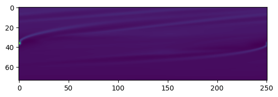
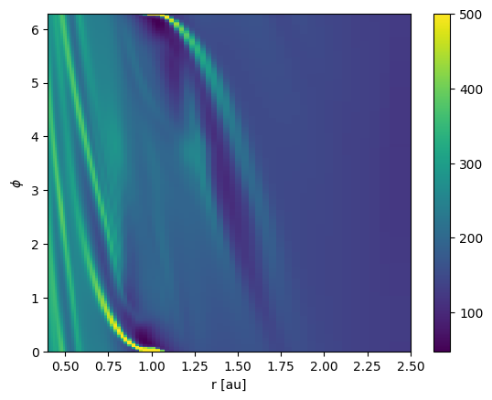
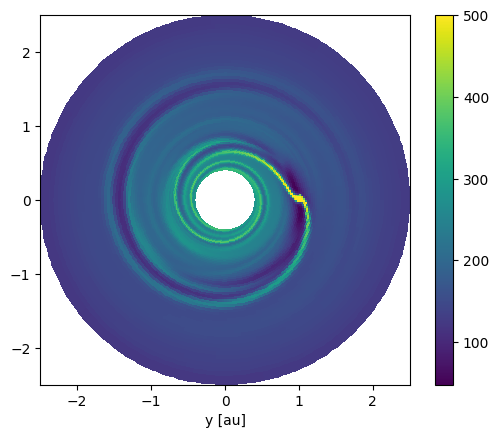

## Manual 2d data loading

This example will teach you how to manually load the 2d output files.

We will use the data from the simulation in the quickstart example, so make sure you ran this beforehand.

First, lets get the number of cells in each direction of the grid by loading the dimensions.dat file.


```python
import numpy as np
datadir = "example_dirs/100_quickstart/output/out"
dimensions = {k:v for k,v in zip(
    ["RMIN", "RMAX" ,"PHIMIN", "PHIMAX", "NRAD" ,"NAZ","NGHRAD","NGHAZ","Radial_spacing"],
    np.genfromtxt(datadir + "/dimensions.dat", dtype=[float, float, float, float, int, int, int, int, 'S20'])[()])}
Nrad = dimensions["NRAD"]
Naz = dimensions["NAZ"]

```

Next, load the base units from the units.dat file.


```python
dimensions
```


    {'RMIN': 0.4,
     'RMAX': 2.5,
     'PHIMIN': 0.0,
     'PHIMAX': 6.283185307179586,
     'NRAD': 74,
     'NAZ': 251,
     'NGHRAD': 1,
     'NGHAZ': 1,
     'Radial_spacing': b'Logarithmic'}


```python
import yaml
units = {}
with open(datadir + "/units.yml") as infile:
    unit_data = yaml.safe_load(infile)
    for key, value in unit_data.items():
        units[key] = value["unit"]
units
```


    {'length': '14959787070000 cm',
     'mass': '1.9884699999999999e+33 g',
     'time': '5022566.9513368811 s',
     'temperature': '106700.1843026118 K',
     'energy': '1.7640804944591272e+46 erg',
     'energy surface density': '7.8825652402193138e+19 erg cm^-2',
     'density': '5.939403178403638e-07 g cm^-3',
     'mass surface density': '8885220.687179964 g cm^-2',
     'opacity': '1.1254644484439755e-07 g^-1 cm^2',
     'energy flux': '15694295997629.604 erg cm^-2 s^-1',
     'velocity': '2978514.216922102 cm s^-1',
     'angular momentum': '8.8602123909684364e+52 cm^2 g s^-1',
     'kinematic viscosity': '4.4557938470122439e+19 cm^2 s^-1',
     'dynamic viscosity': '26464756137255.898 P',
     'acceleration': '0.59302628432445215 cm s^-2',
     'stress': '7.8825652402193138e+19 g s^-2',
     'pressure': '7.8825652402193138e+19 dyn cm^-1',
     'power': '3.5123085696041805e+39 erg/s',
     'potential': '8871546940407.084 erg/g',
     'torque': '1.7640804944591272e+46 erg',
     'force': '1.1792149755906433e+33 dyn',
     'mass accretion rate': '3.959071166728239e+26 g s^-1'}


Finally, lets load some data from an output file.
We'll start with surface density from snapshot number 2.


```python
Nsnap = 2
datafile = datadir + f"/snapshots/{Nsnap}/Sigma.dat"
Sigma_raw = np.fromfile(datafile, dtype=np.float64)
Sigma_raw.shape
```


    (18574,)


The data is stored on disk as a 1D-array, so we need to reshape it to the correct 2d form.


```python
Sigma_reshaped = Sigma_raw.reshape(Nrad, Naz)
Sigma_reshaped.shape
```


    (74, 251)


At this point, the values are in code units, which can be anything.
Because we have all the unit information loaded already, we can convert the values to something more understandable.
I suggest using the astropy library to handle the unit conversions.


```python
import astropy.units as u
L0 = u.Unit(units["length"])
M0 = u.Unit(units["mass"])
T0 = u.Unit(units["time"])
print("L0 =", L0)
print("M0 =", M0)
print("T0 =", T0)
```

    L0 = 1.49598e+13 cm
    M0 = 1.98847e+33 g
    T0 = 5.02257e+06 s


```python
Sigma = Sigma_reshaped * M0 / L0**2
Sigma[0][0]
```


$3.2442895 \times 10^{-5} \; \mathrm{8885220.7\,\frac{g}{cm^{2}}}$


Now the values carry a unit, though this is still the code unit for surface density.
The Sigma variable now points to an astropy.units.Quantity object, which is a numpy array with some extra information like the unit and some extra methods to convert these units.


```python
Sigma = Sigma.to("g/cm2")
Sigma[0][0]
```


$288.26228 \; \mathrm{\frac{g}{cm^{2}}}$


Before we construct a grid, lets have a look at the data.


```python
import matplotlib.pyplot as plt
plt.imshow(Sigma.to_value("g/cm2"))
```


    <matplotlib.image.AxesImage at 0x7f3d66dd81f0>


    

    


Fargo only stores basic information about the grid which we already loaded above.
We will now construct arrays with the coordinates on the cell interfaces.


```python
if dimensions["Radial_spacing"] == b'Logarithmic':
    ri = np.geomspace(dimensions["RMIN"], dimensions["RMAX"], Nrad+1)
else:
    ri = np.linspace(dimensions["RMIN"], dimensions["RMAX"], Nrad+1)
ri = ri*L0

phii = np.linspace(dimensions["PHIMIN"], dimensions["PHIMAX"], Naz+1)
```

Now we have all information to make a colormap plot of the surface density.


```python
Ri, Phii = np.meshgrid(ri, phii, indexing="ij")
pcm = plt.pcolormesh(Ri.to_value("au"), Phii, Sigma.to_value("g/cm2"), vmax=500)
plt.xlabel("r [au]")
plt.ylabel(r"$\phi$")
cbar = plt.colorbar(pcm)
```


    

    


And a top down view on the disk.


```python
Ri, Phii = np.meshgrid(ri, phii, indexing="ij")
Xi = Ri*np.cos(Phii)
Yi = Ri*np.sin(Phii)
pcm = plt.pcolormesh(Xi.to_value("au"), Yi.to_value("au"), Sigma.to_value("g/cm2"), vmax=500)
plt.xlabel("x [au]")
plt.xlabel("y [au]")
plt.gca().set_aspect("equal")
cbar = plt.colorbar(pcm)
```


    

    


The surface density values are defined on the cell center locations.
Fargo uses a staggered grid, which means that the velocities are defined on the cell interfaces.
The radial velocity is defined on the radial cell interfaces and the azimuthal velocity is defined on the azimuthal cell interfaces.
As a result, there are more values in the radial velocity array because there is one more radial interface location compared to radial center locations. This means the respective array has Naz more values.
Let's see for ourselves.


```python
Nsnap = 2
datafile = datadir + f"/snapshots/{Nsnap}/vrad.dat"
vrad_raw = np.fromfile(datafile, dtype=np.float64)
vrad_raw.shape
```


    (18825,)


```python
print("len(Sigma_raw) =", len(Sigma_raw))
print("len(vrad_raw) =", len(vrad_raw))
```

    len(Sigma_raw) = 18574
    len(vrad_raw) = 18825


```python
len(vrad_raw) - len(Sigma_raw)
```


    251


```python
Naz
```


    251


Again, reshape and apply units.


```python
vrad_reshaped = vrad_raw.reshape(Nrad+1, Naz)
vrad = vrad_reshaped * L0 / T0
```

For the azimuthal velocity, there are as many values as in the surface density array.
This is because the azimuthal boundary is periodic, so we do not need to store both the the values on the first and the last interface locations since these values are identical by construction.
The energy values are also defined at the cell centers, so its the same procedure as for the surface density.


